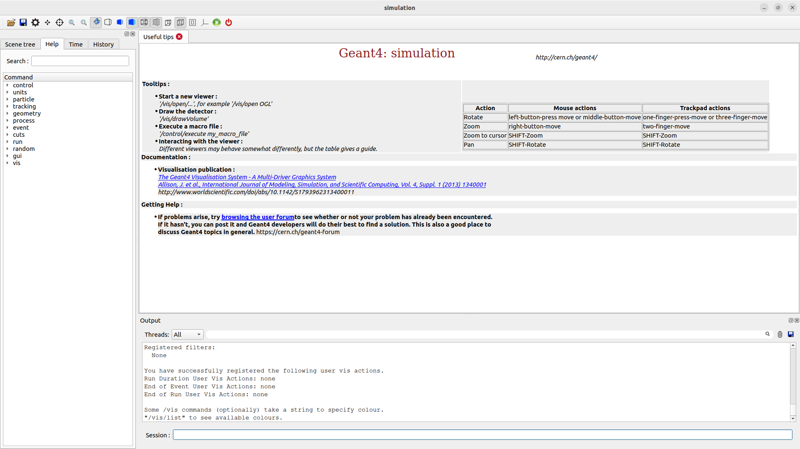

# Creating a New Project
Reference: https://www.youtube.com/watch?v=RuyMUswYaWo

## 1. Source Geant4
You have to run `source /path/to/geant4-v11.4.0-install/bin/geant4.sh`

I've created a script to do this, so I run: <br>
`source /path/to/activate.sh`

## 2. Create a Directory for Your Project
Example: 
```
mkdir /path/to/myproject
cd /path/to/myproject
```

Your project structure at the *end* of the following steps should look something like this:
```
myproject/
    ├─ build/
    ├─ src/
    │  ├─ myproject.cc
    ├─ CMakeLists.txt

```

## 3. Create CMakeLists.txt
Open CMakeLists.txt in a text editor and modify the following template:

```
cmake_minimum_required(VERSION 3.2 FATAL_ERROR)

project(MyProject)

find_package(Geant4 REQUIRED ui_all vis_all)

include(${Geant4_USE_FILE})
include_directories(${PROJECT_SOURCE_DIR}/include)

file(GLOB sources ${PROJECT_SOURCE_DIR}/src/*.cc)
file(GLOB headers ${PROJECT_SOURCE_DIR}/include/*.hh)

add_executable(simulation src/simulation.cc ${sources} ${headers})
target_link_libraries(simulation ${Geant4_LIBRARIES})

add_custom_target(MyProject DEPENDS simulation)

install(TARGETS simulation DESTINATION bin)
```
Note: Rename `MyProject`, `simulation.cc` and `simulation` as per your needs!

## 4. Create the Source Code
Create a .cc file (name must match what you've specified in CMakeLists.txt)

Example:
```
mkdir src
cd src
touch simulation.cc
```

Open the file and enter the paste the template code:
```
#include <iostream>

#include "G4RunManager.hh"
#include "G4UIExecutive.hh"
#include "G4VisManager.hh"
#include "G4VisExecutive.hh"
#include "G4UImanager.hh"

int main(int argc, char **argv) {
    G4RunManager *runManager = new G4RunManager();

    // This must be uncommented when making something 
    // that actually does something
    // But uncommenting it now will cause an error
    // runManager->Initialize();

    G4UIExecutive *ui = new G4UIExecutive(argc, argv);

    G4VisManager *visManager = new G4VisExecutive();
    visManager->Initialize();

    G4UImanager *uiManager = G4UImanager::GetUIpointer();

    ui->SessionStart();


    return 0;
}
```

## 5. Build the Project
Create a directory called 'build' and cd to it:
```
cd /path/to/myproject
mkdir build
cd build
```
First, run:
```
cmake ..
```
If you get an error saying CMake can't find Geant4, you've probably made a mistake while sourcing Geant4.

Then, run:
```
make
```
If you get an error now, it's likely a mistake in your source code.

If everything worked correctly, there should be a executable file called `simulation` in `build`. 

Run it:
```
./simulation
```
A Geant4 simulation window should open up. The code doesn't actually specify any simulation, so the window won't actually do anything interesting.

