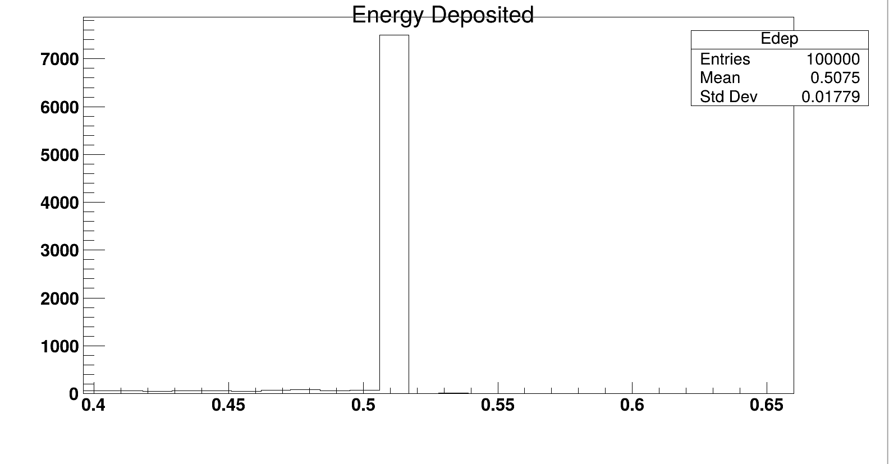

## Radioactive Decay Simulation in Geant4
Simulation of radioactive decay of Flourine-18, and a Sodium Iodide scintillator, to detect gamma-rays. Writes output to a ROOT file, including a histogram.

This project is created following the tutorial series: https://youtube.com/playlist?list=PLLybgCU6QCGUYAOwtyI4U8cRL6ig0p3c7&si=yS8TmU0X4HzbdTNE

### Output
In theory, Flourine-18 decays by emitting a positron, which finds an electron, leading to their annihilation. This produces two gamma-ray photons each with an energy of 5.11 MeV. 
This is reflected in by the spike at 5.11 MeV in the histogram of detected photons in the scintillator.

